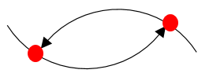
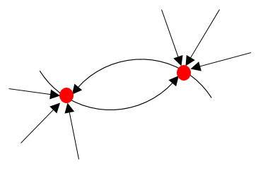
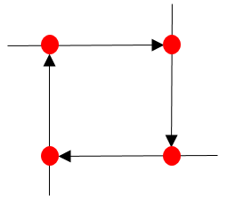

##Module 5. Java: Troubleshooting

**Task 1 (Simple Deadlock)**: Implement java application to reproduce deadlock below.
Collect thread dumps.

Results of the task:

 - Java source code
 - Collected thread dumps

**Task 2 (Realistic Deadlock)**: Implement java application to reproduce deadlock below.
Collect thread dumps.

 
Results of the task:

 - Java source code
 - Collected thread dumps

**Task 3 (Deadlock with 4 shared resources)**: Implement java application to reproduce deadlock below.
Collect thread dumps.

 
Results of the task:

- Java source code
- Collected thread dumps